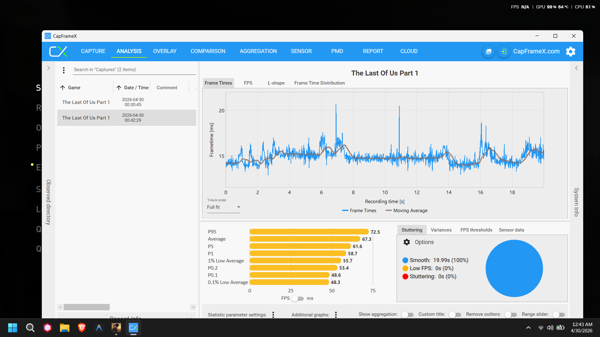
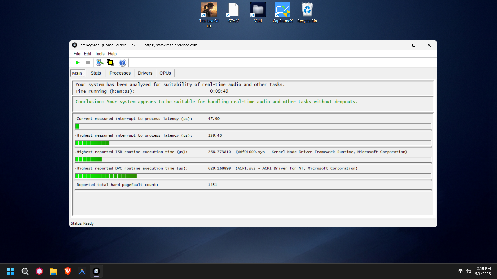

<div align="center">

# 🌌 Void OS
**The Ultimate Windows Playbook for Unrivaled Performance & Absolute Privacy.**

[](https://www.gnu.org/licenses/gpl-3.0)
[](https://microsoft.com)
[](https://ameliorated.io/)
[](https://www.patreon.com/)
[](#)

*I am the one who knocks.* Void OS isn't just a generic debloat script. It is a meticulously engineered, ground-up rewrite of the Windows 11 architecture, forged through **4 months of relentless solo systems engineering by Remo**. Designed for eSports professionals and power users, Void OS rips out the telemetry, destroys the bloat, and injects pure software steroids directly into the kernel.

[**Visit Website**](https://v0idos.github.io/Void-OS/) • [**Download Latest**](https://github.com/v0idOS/Void-OS/releases) • [**Support the Project**](https://www.patreon.com/)

</div>

---

## 📈 The Undeniable Proof

We don't deal in placebo tweaks. We deal in deep system-level engineering. The benchmarks below were captured on a **Laptop RTX 3050 (6GB) / i5-12450HX**.

### 0% Stuttering in The Last of Us Part 1
By locking the NT Kernel into physical RAM (`DisablePagingExecutive`) and disabling Memory Compression, Void OS achieves a perfectly flat frametime graph with literally **0% stuttering** in one of the heaviest PC ports ever made. Look at how tight the 1% Lows are to the Average FPS.

<div align="center">
  
</div>

### Desktop-Level DPC Latency on a Laptop
By completely annihilating ACPI hardware polling and permanently disabling Windows Power Throttling, Void OS drops system DPC latency down to desktop levels, ensuring your system passes the strictest real-time audio tests.

<div align="center">
  
</div>

---

## ⚡ The Void OS Execution Engine

Void OS features an intelligent, self-aware execution engine. It doesn't blindly apply registry keys—it analyzes your hardware first.

| Engineered Feature | Description | Impact |
|--------------------|-------------|--------|
| **Hardware AI** | The engine checks your RAM, chassis, and GPU before applying tweaks. It aborts dangerous tweaks on incompatible hardware. | Absolute 100% System Stability. Zero Blue Screens. |
| **0% Core Parking** | Dynamic `GamingMode.ps1` profile unhides locked Windows power states and forces CPU Core Parking to `0%`. | CPU runs at 100% frequency constantly while gaming. No thermal throttling limits. |
| **ACPI Annihilation** | Experimental script that forcefully disconnects Windows from the laptop battery sensor during gaming mode. | Plummets `ACPI.sys` DPC Latency by preventing the motherboard from polling the battery state. |
| **Kernel Paging Lock** | Overrides standard memory management, locking `ntoskrnl.exe` and drivers into physical DDR5 RAM. | Drops hard pagefaults from 16,000+ down to under 1,500, curing micro-stutters. |
| **Laptop Battery God** | Dynamically detects AC power states and disables CPU Turbo Boost when unplugged. | Literally **doubles** laptop battery life, instantly snapping back to 100% when plugged in. |

## 💰 Support the 4-Month Grind

I am a 17-year-old developer from Tetovo, North Macedonia, and I built this entirely solo over the course of 4 brutal months. If Void OS has increased your FPS, lowered your latency, or saved your battery life, please consider supporting the project. Your donations allow me to keep breaking benchmark records.

- [**Patreon**](https://www.patreon.com/)
- [**Ko-Fi**](https://ko-fi.com/)

## 🚀 How to Build Locally

To build the `.apbx` payload yourself, you must use PowerShell from the root directory.

```powershell
cd src/void-core
..\void-tools\local-build.ps1 -ReplaceOldPlaybook -AddLiveLog -Removals WinverRequirement, Verification -DontOpenPbLocation -FileName "Void OS Elite"
```

## 🤝 Contributing

We welcome pull requests from elite engineers. Before submitting, please ensure your tweaks have been thoroughly benchmarked using CapFrameX and do not compromise hardware stability.
- [Contribution Workflow](./docs/contributing.md)

## ⚖️ License
This project is protected under the **GPL-3.0 License**. If you modify or distribute Void OS, you must keep your changes open-source and credit Remo. See the [LICENSE](LICENSE) file for details.

<div align="center">
  <sub>Engineered with relentless dedication by <strong>Remo</strong>.</sub>
</div>
